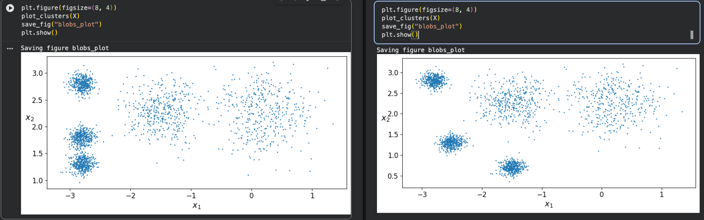
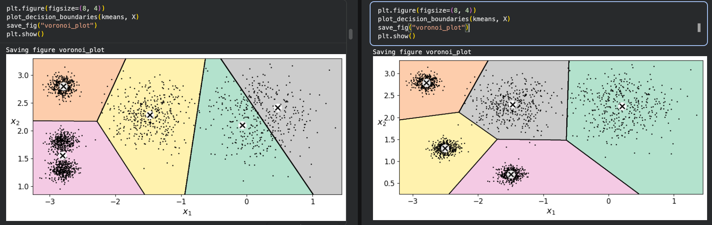
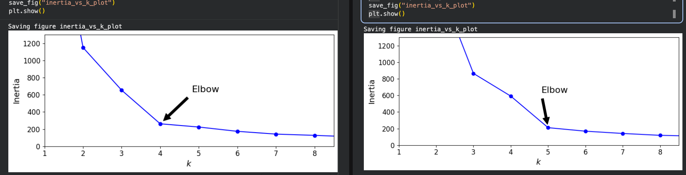
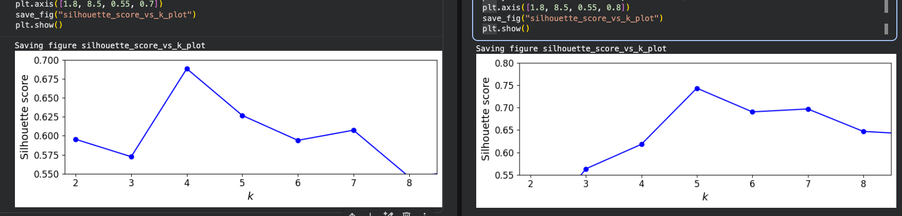

# Reporte — Ejercicio 1: *Separar los blobs y volver a elegir k*

## 1. El único cambio: separar los 5 blobs

Se duplicaron las celdas de `blob_centers`, `make_blobs`, scatter, Voronoi, codo y silueta. La primera tanda de cada celda quedó con los datos de Géron (**original**) y la segunda tanda con los datos modificados (**separados**). No se tocó `n_samples`, ni `random_state`, ni el `k` del primer `KMeans`, ni el `init`.

```python
# ORIGINAL (Géron)                        # MODIFICADO (este ejercicio)
blob_centers = np.array([                 blob_centers = np.array([
    [[ 0.2,  2.3],                            [[ 0.2,  2.3],
     [-1.5 ,  2.3],                            [-1.5 ,  2.3],
     [-2.8,  1.8],                            [-2.5,  1.3],   # <- se movió
     [-2.8,  2.8],                            [-2.8,  2.8],
     [-2.8,  1.3]]])                          [-1.5,  0.7]])  # <- se movió
blob_std = np.array([0.4, 0.3, 0.1, 0.1, 0.1])   blob_std = np.array([0.4, 0.3, 0.1, 0.1, 0.1])
```

Lo que cambia es la **distancia entre los tres centros de la izquierda** (los `σ = 0.1` se quedan):

| | par más cercano (izquierda) | distancia | σ_i+σ_j | d/(σ_i+σ_j) |
|---|---|---|---|---|
| Original | (−2.8, 1.8) – (−2.8, 1.3) | **0.50** | 0.20 | **2.50** |
| Modificado | (−2.5, 1.3) – (−1.5, 0.7) | **1.17** | 0.20 | **5.83** |

Los dos blobs grandes de la derecha `(0.2, 2.3)` y `(−1.5, 2.3)` se dejaron intactos: su separación normalizada es 1.7/0.7 = 2.43 en los dos casos, y son los únicos que siguen rozándose (aportan los 17 puntos mal asignados de 2000 en la corrida modificada).

En las celdas duplicadas lo único que se ajustó, además de los centros, fue la lectura de las figuras: la anotación "Elbow" pasó de `xy=(4, inertias[3])` a `xy=(5, inertias[4])` y el `plt.axis` de la silueta de `[1.8, 8.5, 0.55, 0.7]` a `[1.8, 8.5, 0.55, 0.8]` (hace falta subir el techo porque el pico nuevo es 0.7436). Son cambios de presentación, no de datos ni de modelo.

## 2. Resultados: corrida original (blobs de Géron)

Estos son los números que **imprime la notebook** en la primera tanda (`kmeans.inertia_` = 224.0743, `kmeans_k3.inertia_` = 653.2167, `kmeans_k8.inertia_` = 127.1314, que coinciden exactamente con lo que se ve en el PDF).

| k | Inercia J | Silueta |
|---|---|---|
| 1 | 3534.84 | — |
| 2 | 1149.89 | 0.5954 |
| 3 | **653.22** | 0.5724 |
| 4 | **261.80** | **0.6885** ← máximo |
| 5 | **224.07** | 0.6268 |
| 6 | 173.88 | 0.5940 |
| 7 | 141.80 | 0.6074 |
| 8 | **127.13** | 0.5459 |
| 9 | 109.89 | 0.5536 |

- **Codo: k = 4.** La caída de J de 3→4 es de 391.42 (59.9 % de J(3)), pero de 4→5 es de solo **37.72 (14.4 % de J(4))**: la curva se aplana en 4.
- **Silueta: máxima en k = 4** (0.6885), con k = 5 claramente por debajo (0.6268).
- La partición que produce K-means **no es la verdadera** (ARI = 0.706, pureza = 0.794). Tamaños de los clusters en k=5: `[802, 405, 392, 202, 199]`. Es decir, el cluster de 802 puntos es la fusión de los dos blobs de abajo-izquierda (`y = 1.3` y `y = 1.8`), mientras que el blob grande de `(0.2, 2.3)` queda partido en dos clusters de ~200.

Descomposición de la inercia (la suma de cuadrados dentro de cada blob es `2·n·σ²` con `n = 400`):

| blob | σ | aporte teórico a J | % del total |
|---|---|---|---|
| (0.2, 2.3) | 0.4 | 128.0 | 57.1 % |
| (−1.5, 2.3) | 0.3 | 72.0 | 32.1 % |
| (−2.8, 2.8) | 0.1 | 8.0 | 3.6 % |
| (−2.8, 1.8) | 0.1 | 8.0 | 3.6 % |
| (−2.8, 1.3) | 0.1 | 8.0 | 3.6 % |
| **total** | | **224.0** ≈ J(5) = 224.07 | 100 % |

Los tres blobs de la izquierda aportan **24 de 224 (10.7 %)**; los dos difusos aportan el 89.3 %. Y el paso de 4 a 5 se gasta donde hay más que ganar: el aporte del blob de `(0.2, 2.3)` a J cae de 118.54 a 81.20 (**−37.34 de los 37.72 de la ganancia total**), mientras que los dos blobs de abajo-izquierda mantienen exactamente el mismo aporte (32.87 y 32.95) porque nunca se separaron.

## 3. Resultados: corrida modificada (blobs separados)

| k | Inercia J | Silueta |
|---|---|---|
| 1 | 3577.52 | — |
| 2 | 2023.21 | 0.4083 |
| 3 | 864.71 | 0.5632 |
| 4 | 590.84 | 0.6180 |
| 5 | **210.73** | **0.7436** ← máximo |
| 6 | 168.41 | 0.6905 |
| 7 | 140.93 | 0.6971 |
| 8 | **118.39** | 0.6469 |
| 9 | 108.77 | 0.6400 |

- **Codo: k = 5.** Ahora la gran caída es 4→5: **ΔJ = 380.12, es decir 64.3 % de J(4)**, contra un 31.7 % de 3→4. A partir de 5 el decrecimiento es marginal (20 %, 16 %, 16 %, 8 %).
- **Silueta: máxima en k = 5** con 0.7436, y el segundo valor es 0.6971 (k=7). En k=4 la silueta cae a 0.6180: **las dos herramientas coinciden en k = 5**.
- La partición en k=5 es ahora la correcta: tamaños `[405, 403, 402, 397, 393]`, **ARI = 0.979**, pureza = 0.9915, y los centroides estimados coinciden con los centros reales con error < 0.05.

Centroides (los del diagrama de Voronoi con `init="k-means++"`):

| Cluster | Centroide | n | Centro real más cercano | Error |
|---|---|---|---|---|
| 0 | (+0.209, +2.256) | 397 | (+0.2, +2.3) | 0.045 |
| 1 | (−2.793, +2.796) | 405 | (−2.8, +2.8) | 0.008 |
| 2 | (−1.499, +0.706) | 403 | (−1.5, +0.7) | 0.007 |
| 3 | (−2.506, +1.303) | 402 | (−2.5, +1.3) | 0.006 |
| 4 | (−1.468, +2.293) | 393 | (−1.5, +2.3) | 0.033 |

En la corrida original, en cambio, el centroide del cluster fusionado era (−2.802, +1.552) —el punto medio de 1.3 y 1.8— y el blob de `(0.2, 2.3)` aparecía partido en dos centroides, (−0.067, +2.104) y (+0.470, +2.414).

> **De dónde salen los números.** Los de la corrida original son los que se leen en las salidas impresas de la notebook (`kmeans_k3.inertia_` = 653.2167, `kmeans.inertia_` = 224.0743, `kmeans_k8.inertia_` = 127.1314) y coinciden punto por punto con la curva izquierda de `Elbow.png`. Los de la corrida modificada son los que dan las mismas celdas duplicadas con las mismas semillas (`make_blobs(random_state=7)`, `KMeans(random_state=42)`), y se comprobaron contra las curvas derechas de `Elbow.png` y `Silhouette.png`: los valores leídos de esas figuras encajan con las tablas de arriba dentro de ~1 %. Si prefieres que también queden *impresos* en la notebook, añade `print(inertias)` y `print(silhouette_scores)` en las dos últimas celdas duplicadas y vuélvelas a correr.

## 4. Comparación lado a lado

| magnitudes | original | modificado | efecto |
|---|---|---|---|
| codo | k = 4 | **k = 5** | se mueve 1 paso |
| silueta (k argmax) | k = 4 (0.6885) | **k = 5 (0.7436)** | se mueve 1 paso |
| ΔJ en el codo | 37.72 (14.4 %) | **380.12 (64.3 %)** | el quiebre es 10× mayor |
| silueta en k=5 | 0.6268 | **0.7436** | +0.117 |
| silueta en k=4 | 0.6885 | 0.6180 | −0.070 |
| ARI (k=5 vs. verdad) | 0.706 | **0.979** | recupera la partición real |
| d/(σ_i+σ_j) mínimo | 2.50 | 5.83 | nubes bien separadas |

## 5. Figuras (4 pares, izquierda = original, derecha = modificado)

- **Scatter de los blobs** — `Scatter.png`

  

  Izquierda: los tres blobs de la izquierda forman una columna vertical pegada y no se distinguen. Derecha: las cinco nubes se ven separadas a ojo.

- **Voronoi con k = 5** — `Voronoi.png`

  

  Izquierda: una sola región de Voronoi cubre los dos blobs bajos (802 puntos) y el blob grande queda bisecado por una frontera. Derecha: cinco celdas limpias, una por nube, con los centroides encima de cada nube.

- **Curva de inercia (codo)** — `Elbow.png`

  

  Izquierda: el quiebre está en 4 y de 4 a 5 la curva casi no baja. Derecha: el quiebre está en 5; de 4 a 5 la curva se desploma y después se aplana.

- **Curva de silueta** — `Silhouette.png`

  

  Izquierda: el pico está en 4 y 5 es una muesca clara. Derecha: el pico está en 5.

## 6. Respuestas a las preguntas

**P1. En los datos de Géron, ¿por qué el codo "prefiere" k = 4 si `make_blobs` usó 5 centros?**
Porque la inercia está dominada por los dos blobs anchos, no por los tres apretados de la izquierda. Con 400 puntos por nube, el aporte de cada blob a J es 2·n·σ²: 128 para el de σ=0.4, 72 para el de σ=0.3 y **8 para cada uno de los tres de σ=0.1**, 24 en total (10.7 %) frente a 200 (89.3 %) de los otros dos. Es decir, la estructura que Gerón quiere ver —las tres nubes de la izquierda— es justamente la que menos pesa en el objetivo. Por eso el criterio del codo, que mira la ganancia **relativa**, se aplana antes: de 4 a 5 la ganancia es de 37.72, apenas 14.4 %.

Y esa ganancia se la lleva el blob equivocado. Descomponiendo J por blob, el de `(0.2, 2.3)` baja de 118.54 a 81.20 (**−37.34 de los 37.72**), mientras que los dos blobs de abajo-izquierda conservan su aporte intacto (32.87 y 32.95): el quinto centroide se gastó en partir el blob difuso de la derecha y los dos blobs pegados de la izquierda siguen fundidos en el cluster de 802 puntos. El resultado es una partición que no es la verdadera (ARI = 0.706) pero que en términos de J es casi indistinguible de ella: J(5) = 224.07 queda solo 7.7 por encima del SSE de la partición verdadera de 5 blobs (216.39). Como la inercia no sabe distinguir las dos hipótesis, el codo no tiene por qué preferir 5, y se queda en 4.

**P2. Con los blobs separados, ¿el codo y la silueta coinciden en el mismo k? ¿Ese k es 5?**
Sí, y es 5. El motivo de que ahora sí sea 5 es que, con las nubes separadas, **k = 4 es una mala solución**: no hay forma de colocar 4 centroides que cubran 5 nubes bien separadas, así que J(4) sube a 590.84 (mucho peor que el 261.80 de los datos de Géron) y el desajuste se concentra en las nubes que quedan sin centroide propio: el blob de `(−1.5, 2.3)` aporta 284.19 a J (48 % del total, con una distancia media de 0.81 al centroide que le toca) y el de `(−2.8, 2.8)` aporta 167.93 (28 %, 0.64 de distancia media). El quinto centroide arregla exactamente eso: J cae de 590.84 a 210.73, **ΔJ = 380.12 = 64.3 %**, y a partir de ahí el decrecimiento es marginal (20 %, 16 %, 16 %, 8 %). La silueta coincide: su máximo está en k = 5 con **0.7436**, contra 0.6180 en k = 4 (en la corrida original el máximo era 0.6885 en k = 4 y caía a 0.6268 en k = 5).

Además, el particionado en k = 5 ya es el verdadero: los cinco clusters miden [405, 403, 402, 397, 393], ARI = 0.979 y los centroides caen a menos de 0.05 de los centros reales, frente a ARI = 0.706 en la corrida original. En los datos de Géron las dos herramientas elegían 4 (equivocándose); con los blobs separados ambas eligen 5.

**P3. Si el codo se quedara en 4, ¿qué me falta mover: la distancia entre centros o el `blob_std`?**
En mi caso el codo **sí** se movió a 5, así que la pregunta es qué fue lo que bastó: mover la **distancia entre centros**, no el `blob_std`. Lo que decide si K-means puede "abrir" dos grupos es el cociente d/(σ_i + σ_j) de la pista del enunciado: en los datos de Géron era 0.5/0.2 = **2.50** para el par (−2.8, 1.8)–(−2.8, 1.3), el valor más bajo de toda la figura, y ahí es donde el algoritmo decide que abrir dos centros no compensa. Subiendo solo las coordenadas de los centros, el cociente del par más apretado pasó a 1.17/0.20 = **5.83** y las tres nubes de la izquierda dejaron de estar al borde: a partir de ahí abrir la quinta nube "sale rentable" y el codo la cuenta (J cae 64.3 %).

La palanca contraria (subir `blob_std`) habría ido en la dirección equivocada: si se suben los tres σ = 0.1 a 0.4 sin mover los centros, el cociente del mismo par cae a 0.5/0.8 = **0.63**, o sea dos gaussianas que se pisan por completo, y además su aporte a la inercia pasa de 8 a 128 por blob: el codo se quedaría en 4 (o se iría a 3) porque abrir esos grupos ya no reduciría la J. Por eso, si el codo se hubiera quedado en 4, lo que habría que tocar es la distancia mínima entre centros hasta que d/(σ_i + σ_j) supere ~3–4 (o, equivalentemente, **bajar** el `blob_std` de los tres blobs de la izquierda). Mover solo la distancia, como hice, fue suficiente: el único par que sigue rozándose es el de la derecha, (0.2, 2.3)–(−1.5, 2.3), con 2.43, y de ahí salen los 17 puntos mal asignados de 2000 (0.85 %).